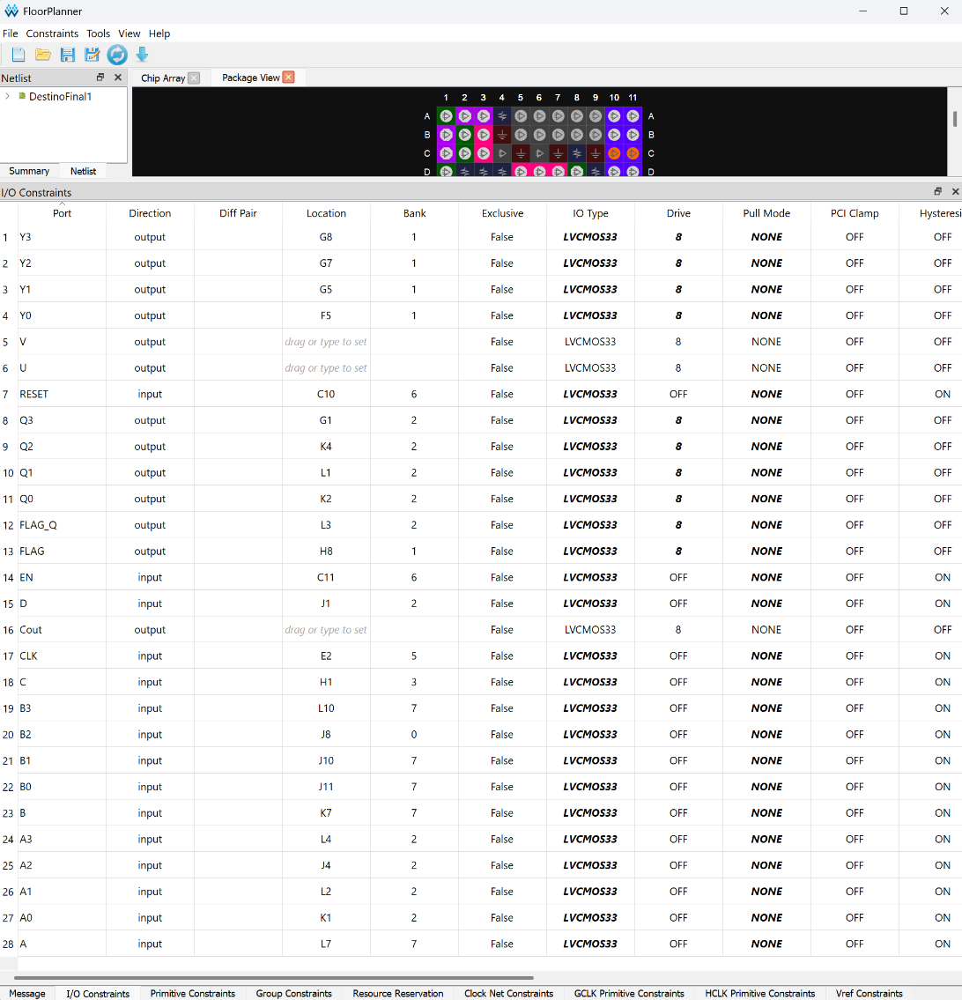
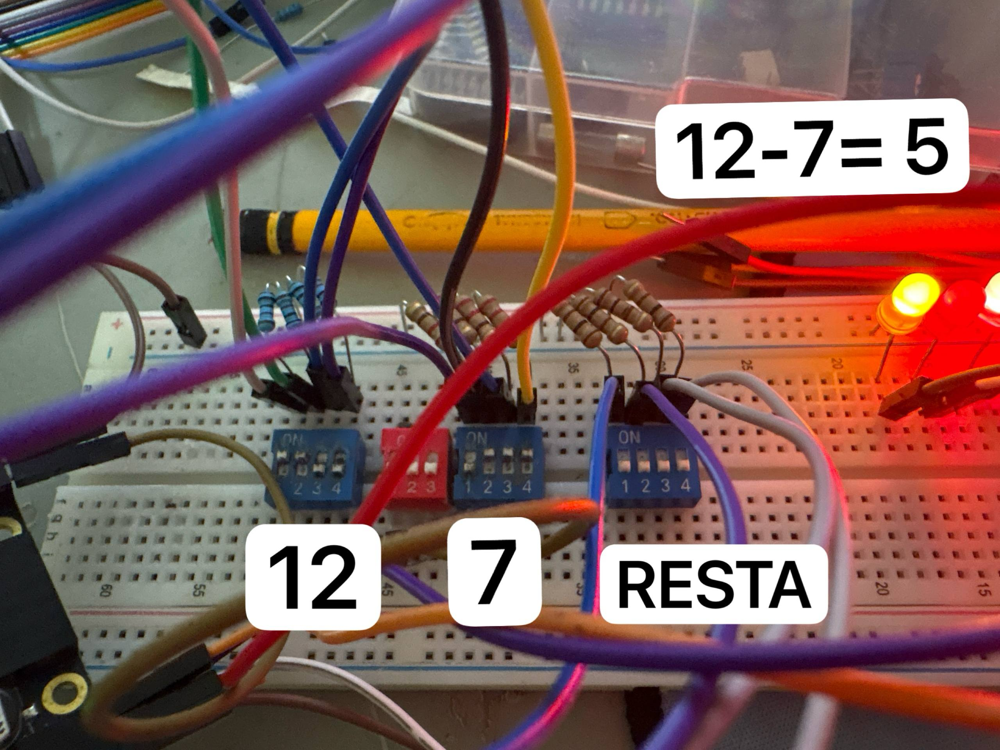
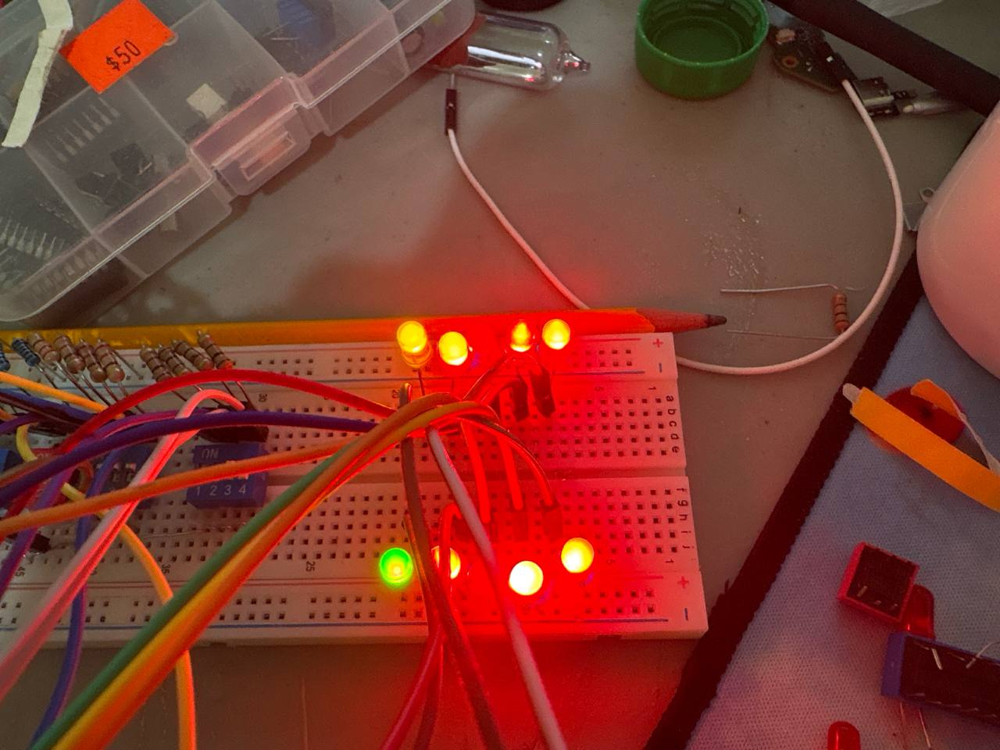
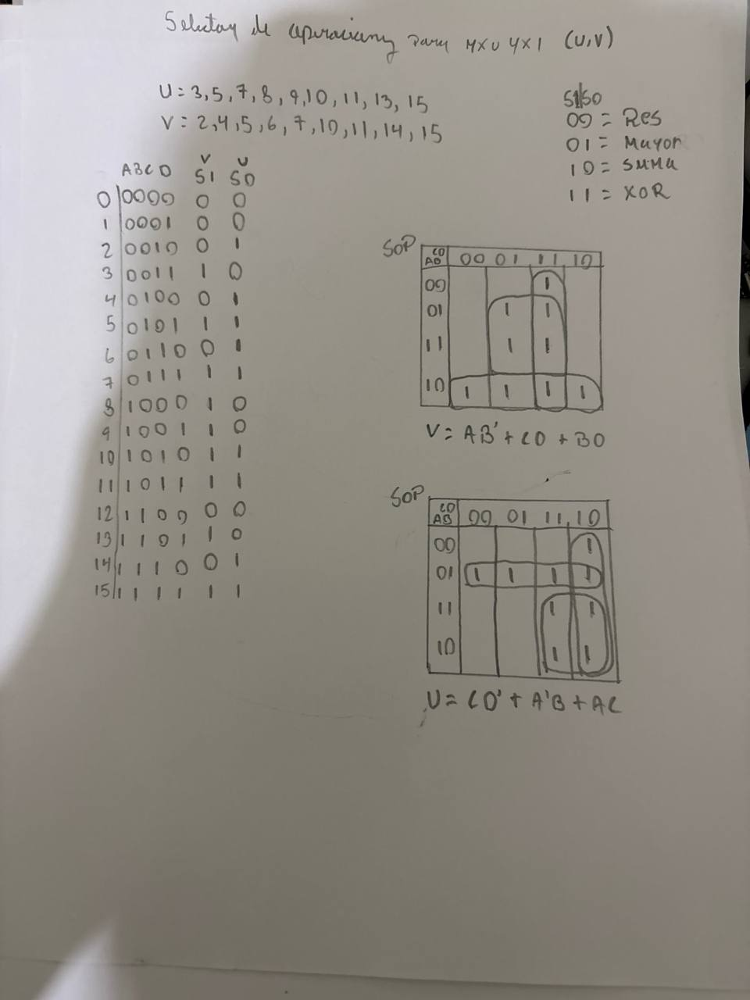
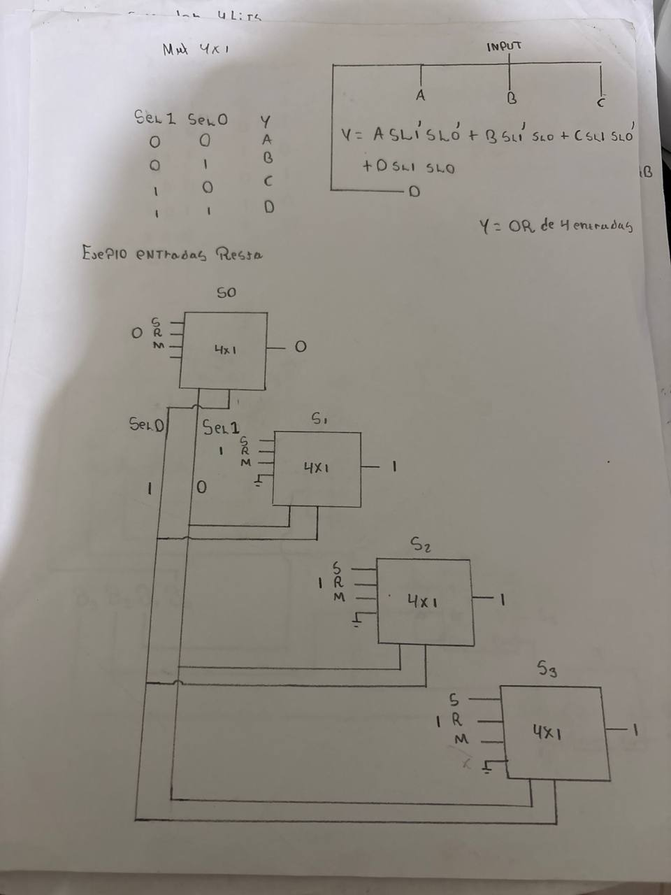

# Primer Parcial — Sistemas Digitales con Verilog

## Combinacional de 4 bits con registro de resultados

**Estudiante:** Bryan Miguel Santana Varela  
**Matrícula:** 2024-0702  
**Carrera:** Mecatrónica — ITLA  
**Lenguaje:** Verilog-2001 estructural  
**FPGA:** Tang Primer 25K — Gowin GW5A-25  
**Versión de entrega:** `v1.0-entrega` 

---

## Descripción del proyecto

Este repositorio contiene el desarrollo del primer parcial de Sistemas Digitales. El proyecto implementa un sistema digital de **4 bits** capaz de seleccionar y ejecutar cuatro operaciones sobre dos operandos binarios `A[3:0]` y `B[3:0]`:

- **Resta** de 4 bits.
- **Comparación**, entregando como resultado el mayor de los dos operandos.
- **Suma** de 4 bits.
- **XOR** bit a bit de 4 bits.

La selección de la operación se realiza a partir de las entradas de control `A`, `B`, `C` y `D`. Estas entradas alimentan la lógica combinacional simplificada mediante mapas de Karnaugh para producir las señales selectoras `U` y `V`.

El resultado combinacional aparece en `Y3:Y0` y la señal `FLAG` cambia de significado según la operación seleccionada. Además, el diseño incorpora un **registro de resultados de 5 bits** controlado por `CLK`, `EN` y `RESET`, cuyas salidas son `Q3:Q0` y `FLAG_Q`.

El diseño fue implementado en la **Tang Primer 25K**, con sus restricciones físicas definidas mediante un archivo `.cst` y con un bitstream `.fs` incluido en el repositorio.

---

## Operaciones implementadas

Las señales `U` y `V` controlan el multiplexor principal del sistema:

| V | U | Operación | Salida `Y[3:0]` | `FLAG` |
|---|---|-----------|------------------|--------|
| 0 | 0 | Resta | `A - B` | Carry de la operación de resta |
| 0 | 1 | Comparador | Mayor entre `A` y `B` | Igualdad `A = B` |
| 1 | 0 | Suma | `A + B` | Carry de salida |
| 1 | 1 | XOR | `A XOR B` | Paridad del resultado XOR |

Las ecuaciones simplificadas utilizadas para las señales selectoras son:

```text
U = AB' + CD + BD
V = CD' + A'B + AC
```

---

## Registro de resultados

El módulo `result_register` almacena el resultado de la operación seleccionada.

- `RESET = 1`: limpia `Q3:Q0` y `FLAG_Q` de forma asíncrona.
- `EN = 1`: en el flanco positivo de `CLK`, almacena `Y3:Y0` y `FLAG`.
- `EN = 0`: conserva el último resultado almacenado.

---

## Estructura del repositorio

```text
sistemas-digitales-parcial1/
├── src/
│   ├── DestinoFinal1.v
│   └── RegistroResultados.v
│
├── sim/
│   ├── test.v
│   └── test_registro.v
│
├── docs/
│   ├── Distribucion_de_pines_Gowin.png
│   └── FPGA SRM34.docx
│
├── fpga/
│   ├── Lab ALU.cst
│   ├── Lab ALU.fs
│   ├── Lab ALU.v
│   └── verity.v
│
├── evidencias/
│   └── fotografías del diseño y pruebas físicas
│
├── .gitignore
└── README.md
```

### Contenido principal

- `src/DestinoFinal1.v`: módulo principal del sistema combinacional y conexión con el registro.
- `src/RegistroResultados.v`: registro de 5 bits para almacenar el resultado y la bandera.
- `sim/test.v`: testbench del bloque combinacional, con recorrido automático de combinaciones de entradas y control.
- `sim/test_registro.v`: testbench del registro, incluyendo reset, captura y retención.
- `fpga/Lab ALU.cst`: restricciones físicas y asignación de pines de la FPGA.
- `fpga/Lab ALU.fs`: bitstream generado para programar la Tang Primer 25K.
- `docs/`: documentación, distribución de pines y material del desarrollo lógico.
- `evidencias/`: fotografías de las pruebas y de la implementación física.

---

## Verificación y simulación

### 1. Revisar el código Verilog

Desde la raíz del repositorio:

```bash
verilator --lint-only -Wall --language 1364-2001 src/*.v
```

### 2. Simular el circuito combinacional

```bash
mkdir -p build
iverilog -g2001 -o build/test \
    src/DestinoFinal1.v \
    src/RegistroResultados.v \
    sim/test.v
vvp build/test
```

El testbench `sim/test.v` recorre automáticamente las combinaciones de los operandos de 4 bits y de las entradas de control, además de mostrar pruebas representativas de suma, resta, comparación y XOR.

Para observar las formas de onda:

```bash
gtkwave build/test.vcd
```

### 3. Simular el registro de resultados

```bash
iverilog -g2001 -o build/test_registro \
    src/DestinoFinal1.v \
    src/RegistroResultados.v \
    sim/test_registro.v
vvp build/test_registro
```

Para abrir sus formas de onda:

```bash
gtkwave build/registro.vcd
```

---

## Implementación en FPGA

El archivo de restricciones físicas se encuentra en:

```text
fpga/Lab ALU.cst
```

El archivo corresponde al dispositivo **GW5A-25** y contiene la asignación física de las entradas, salidas, reloj, enable y reset.

Entre las señales principales se encuentran:

- `A0`–`A3`: operando A.
- `B0`–`B3`: operando B.
- `A`, `B`, `C`, `D`: entradas de control.
- `Y0`–`Y3`: resultado combinacional.
- `FLAG`: bandera de la operación.
- `CLK`, `EN`, `RESET`: control del registro.
- `Q0`–`Q3`: resultado registrado.
- `FLAG_Q`: bandera registrada.

El reloj `CLK` está asignado al pin `E2`.

---

## Programación de la Tang Primer 25K desde WSL / VS Code

El bitstream listo para programación se encuentra en:

```text
fpga/Lab ALU.fs
```

Primero se comprueba que la FPGA sea detectada:

```bash
openFPGALoader --detect
```

La detección correcta debe identificar una FPGA Gowin de la familia `GW5A`, modelo `GW5A-25`.

### Carga temporal

```bash
openFPGALoader -b tangprimer25k "fpga/Lab ALU.fs"
```

### Programación en memoria flash

```bash
openFPGALoader -b tangprimer25k -f "fpga/Lab ALU.fs"
```

Si se utiliza WSL y el dispositivo USB todavía pertenece a Windows, primero debe compartirse y adjuntarse con `usbipd` desde PowerShell de Windows.

---

## Documentación

La documentación del desarrollo se encuentra dentro de `docs/`:

- [Distribución de pines en Gowin](docs/Distribucion_de_pines_Gowin.png)
- [Documento del proyecto](docs/FPGA%20SRM34.docx)

### Distribución de pines



---

## Evidencias

### Implementación y pruebas físicas

| Prueba del circuito | Montaje físico |
|---|---|
|  |  |

### Desarrollo lógico

| Mapas y tabla | Diagrama lógico |
|---|---|
|  |  |

Todas las fotografías adicionales se encuentran en la carpeta [`evidencias/`](evidencias/).

---

## Herramientas utilizadas

- Verilog-2001.
- Visual Studio Code sobre WSL Ubuntu.
- Icarus Verilog para simulación.
- GTKWave para visualización de formas de onda.
- Verilator para revisión de código.
- Gowin EDA para implementación y generación del bitstream.
- openFPGALoader para detección y programación de la FPGA desde WSL.
- Tang Primer 25K / Gowin GW5A-25.

---

## Estado del proyecto

**Proyecto finalizado e implementado físicamente en la FPGA Tang Primer 25K.**

El repositorio incluye código fuente, testbenches, documentación, restricciones físicas, bitstream y evidencias del funcionamiento del proyecto.

---

## Entrega

Repositorio:

[https://github.com/BryanGX258/sistemas-digitales-parcial1](https://github.com/BryanGX258/sistemas-digitales-parcial1)

Versión identificada para evaluación:

```text
v1.0-entrega
```
